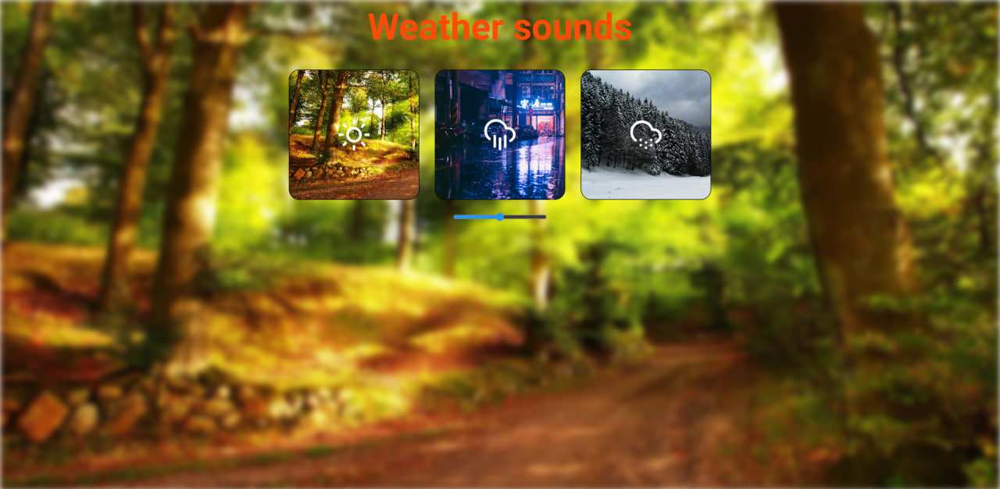

# Weather Sounds App
  - Приложение, воспроизводящее звуки природы в зависимости от выбранной погоды. Реализовано на React + TypeScript с использованием чистого CSS.
    
## Функциональность
  - Выбор одного из трёх звуков природы: лес, дождь, снег
  - Управление воспроизведением: старт, пауза, переключение
  - Изменение громкости через ползунок
  - Динамичная подложка: фон страницы меняется под выбранную погоду
  - SVG-иконки переключаются на "пауза" при воспроизведении
  - Плавный и чистый интерфейс

## Скриншот
   

## Технологии
  - React + TypeScript
  - Vite
  - CSS Modules
  - Аудио через `HTMLAudioElement`
  - Работа с `useRef`, `useState`, динамические классы

## Запуск проекта
  - git clone https://github.com/Menethilzxc/ts-wather.git
  - cd ts-wather.git
  - npm install
  - npm run dev
